# Trabajo Final - Desarrollo de Software Empresarial

## **Índice**

1. [Equipo](#equipo)
2. [Organización](#organización)
3. [Propósito del Proyecto](#propósito-del-proyecto)
4. [Visión general](#visión-general)
5. [Procesos de negocio](#procesos-de-negocio)
6. [Principales servicios REST](#principales-servicios-rest)
7. [Herramienta Swagger](#herramienta-swagger)

## **Equipo**

**Nombre del Equipo:** Equipo de Desarrollo BPM

- Sumire Ramos Marko Julio
- Malcoaccha Díaz Erick Rubén
- Lizarve Mamani Johan Fabricio
- Ramos Quispe Erik Manuel
- Philco Puma Josue Samuel
- Deza Sotomayor Fernando David

## **Organización**

**Nombre:** Banco de la Nación  
**Sitio Web:** https://www.bn.com.pe/

**Descripción:**
El Banco de la Nación es una empresa de derecho público del Sector Economía y Finanzas del Perú, que opera con autonomía económica, financiera y administrativa. Su función principal es administrar las subcuentas del Tesoro Público y proporcionar servicios bancarios para la administración de fondos públicos.

**Misión:**
"Brindar productos y servicios financieros a la población a través de nuestros diversos canales de atención, buscando la innovación continua y la transformación digital para acelerar el proceso de inclusión financiera en nuestro país."

**Visión:**
"Ser un banco moderno, sostenible y accesible a todos los peruanos, que ofrece una experiencia de servicio cercana y de calidad a sus clientes y usuarios."

## **Propósito del Proyecto**

Documentar, modelar y automatizar los procesos clave del Banco de la Nación mediante la notación **BPMN**, e implementar servicios REST que permitan una integración estructurada y estandarizada bajo el enfoque de **arquitectura orientada a servicios (SOA)** y principios de **DDD**.

## Visión general

La aplicación BPM implementada en **Bonitasoft** cuenta con:

- **Application Page personalizada** para visualizar los procesos de la organización.
- **Menú dinámico** que permite a los usuarios acceder a diferentes procesos que ofrece la organización como:
    - Solicitud de crédito
    - Evaluación de inmuebles
    - Desembolso
    - Atención de reclamos
    - Apertura de cuentas

## **Procesos de negocio**

1. **Otorgamiento de Crédito Hipotecario:** Este proceso se subdivide en los siguientes subprocesos:

    - **Evaluación al Cliente:** Evaluar de manera estructurada la capacidad financiera y nivel de riesgo de los clientes al solicitar un crédito. Esto se realiza con el fin de tomar decisiones informadas que garanticen la sostenibilidad financiera

    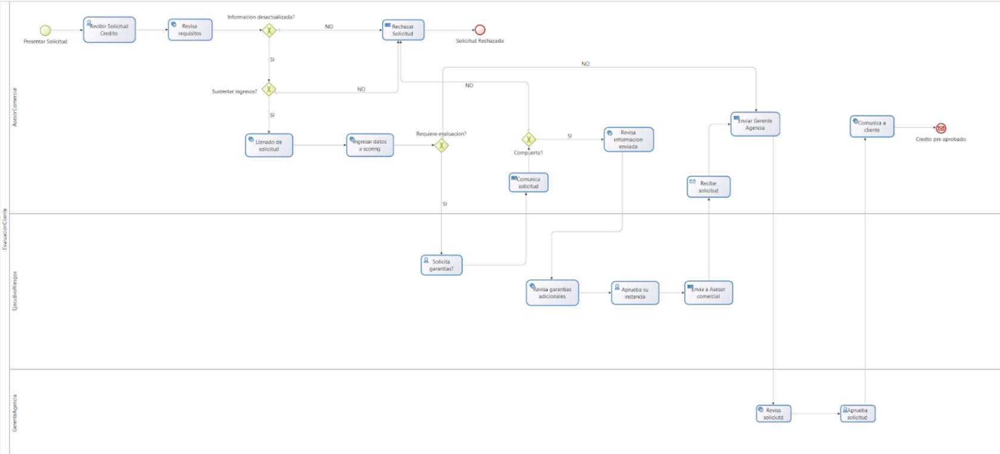

    - **Evaluación de Plan de Estudios:** Verificar si el solicitante cumple con los requisitos y si el plan de estudios presentado puede ser aprobado para el otorgamiento del crédito.

    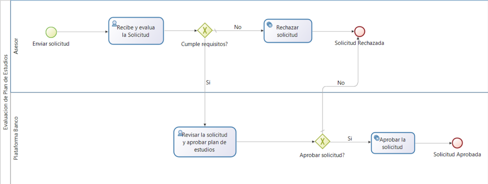

    - **Evaluación de Inmueble:** Definir si el inmueble se encuentra dentro de los parámetros del crédito preaprobado.

    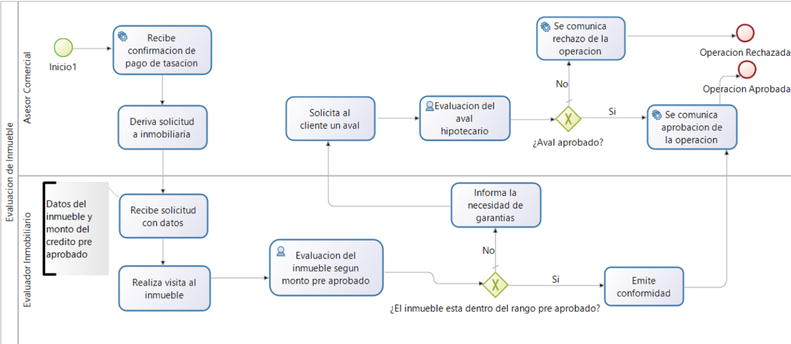

    - **Aprobación y Desembolso:** Gestionar de forma ordenada y eficiente las actividades necesarias para concretar el otorgamiento y desembolso de un crédito hipotecario, asegurando que se cumplan las condiciones estipuladas, se formalicen los compromisos contractuales, y se ejecuten los pagos correspondientes.

    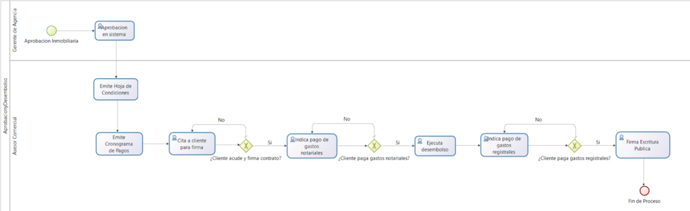

En conjunto con todos estos subprocesos se realiza el proceso para el **Otorgamiento de Crédito Hipotecario**

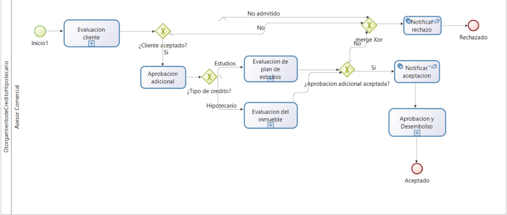

2. **Atención de Reclamos:** Realizar el cambio de situación de las cuentas y la actualización de datos de las cuentas bancarias, que son solicitados por personas naturales, jurídicas, Entidades del Estado o Unidades Orgánicas del Banco.

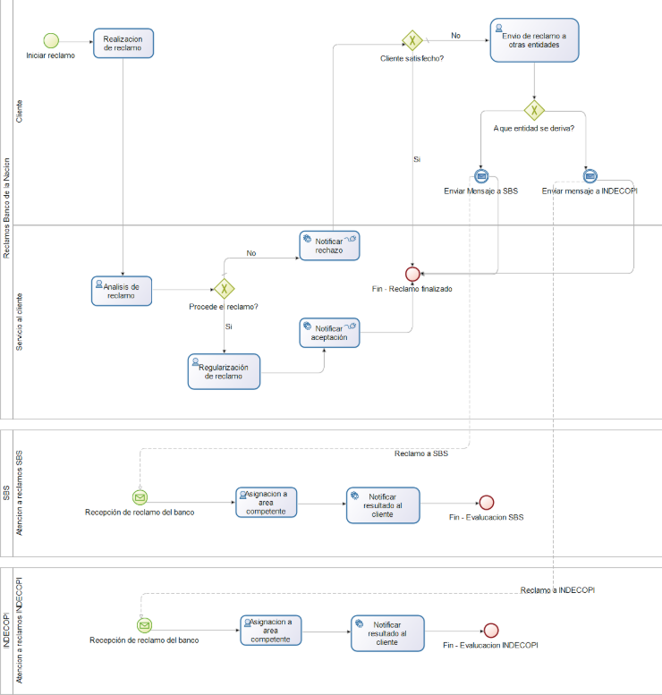

3. **Apertura de Cuenta:** Realizar la apertura de cuentas bancarias a solicitud de las entidades públicas y privadas, para el personal activo, cesante, entre otros beneficiarios, así como realizar la apertura de cuentas bancarias a personas naturales o jurídicas de derecho privado.

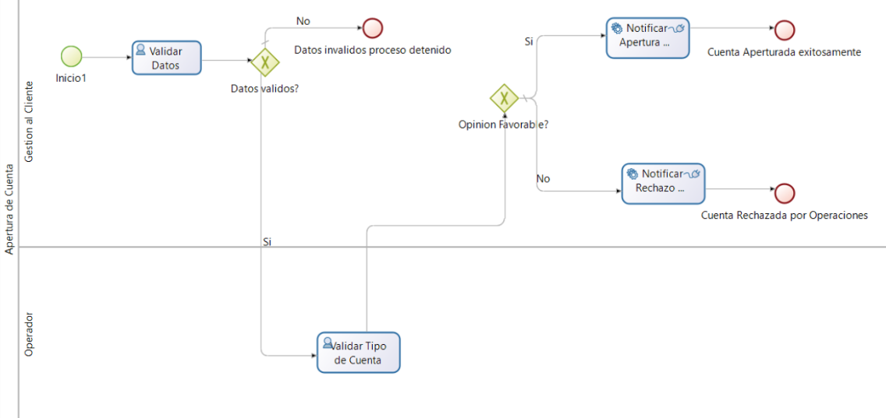

## **Principales Servicios REST**

Los servicios REST fueron documentados utilizando **OpenAPI 3.0**.

### Módulo: Gestión de Solicitud de Crédito  
**Propósito:** Crear y gestionar solicitudes de crédito de clientes.

**Operaciones:**
- `POST /solicitudes` – Crear nueva solicitud
- `GET /solicitudes/{id}` – Obtener estado de solicitud
- `PUT /solicitudes/{id}` – Actualizar datos
- `DELETE /solicitudes/{id}` – Rechazar solicitud

**Modelos:**
- `SolicitudCredito`: Datos personales, tipo de crédito, monto, estado.

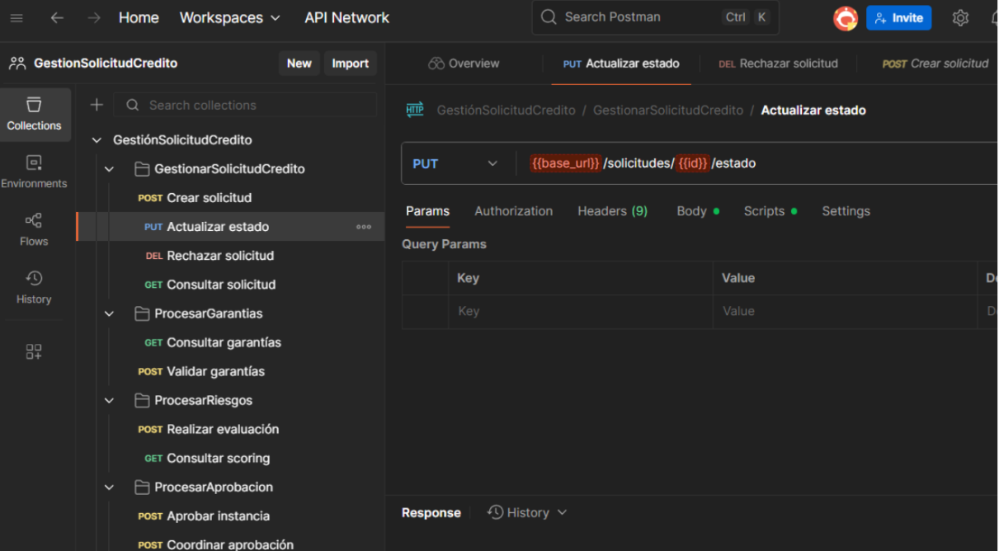

---

### Módulo: Evaluación de Inmuebles  
**Propósito:** Registrar, tasar y validar propiedades para crédito hipotecario.

**Operaciones:**
- `POST /inmuebles` – Registrar inmueble
- `GET /inmuebles/{id}` – Obtener datos
- `PUT /inmuebles/{id}` – Actualizar información
- `DELETE /inmuebles/{id}` – Eliminar registro

**Modelos:**
- `Inmueble`: Dirección, tasación, documentos, estado de aprobación.

---

### Módulo: Gestión de Créditos  
**Propósito:** Formalizar aprobación de créditos y emitir cronogramas.

**Operaciones:**
- `POST /creditos` – Aprobar crédito
- `PUT /creditos/{id}` – Emitir hoja de condiciones
- `GET /creditos/{id}/cronograma` – Obtener cronograma de pagos

**Modelos:**
- `Credito`: Condiciones, plazos, cronograma, estado.
- `Desembolso`: Datos del pago y firma de contrato.

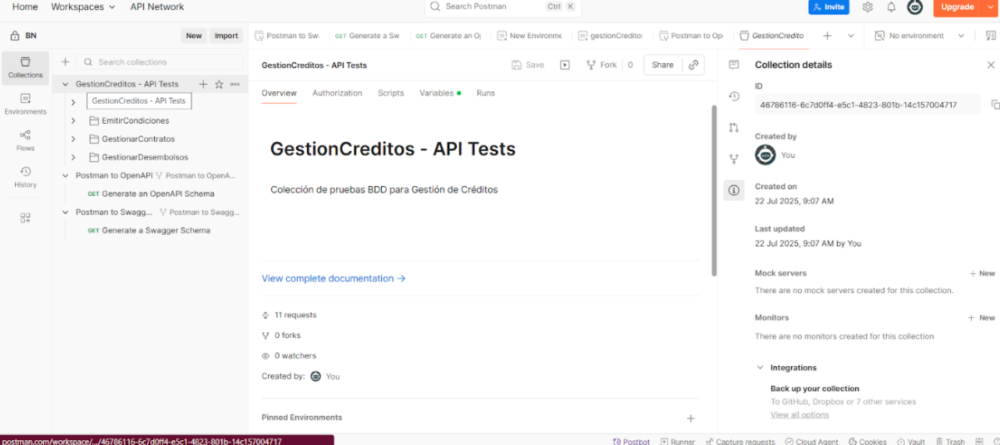

## **Herramienta Swagger**

1. **Gestión de Créditos**

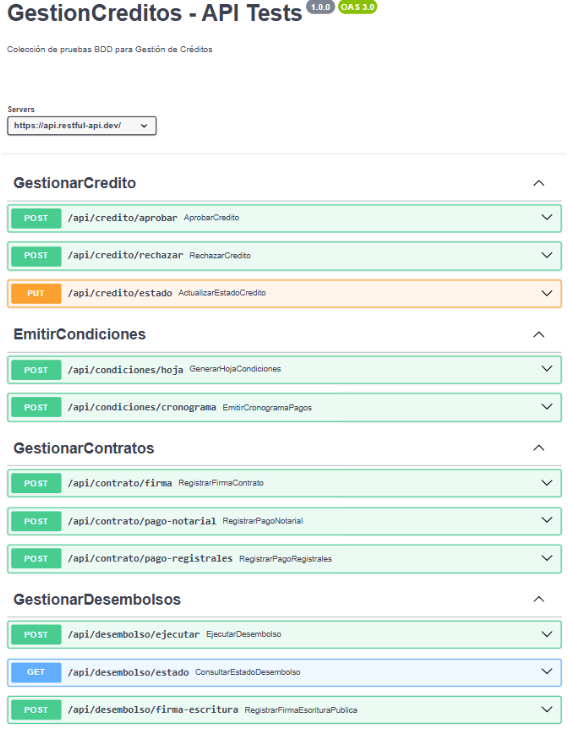

2. **Gestión Inmueble**

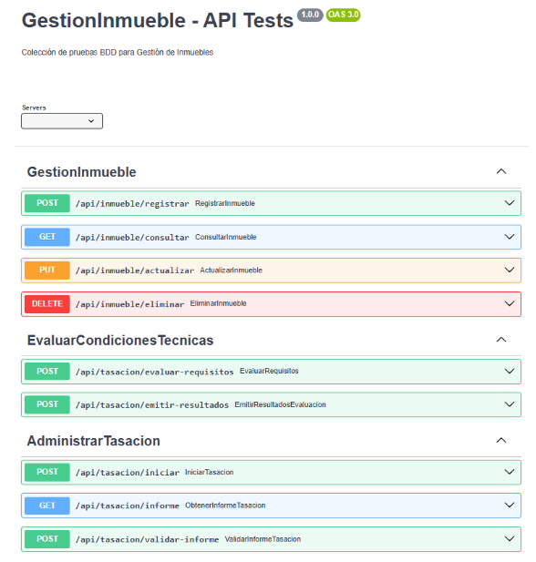

3. **Gestión de Solicitud de Crédito**

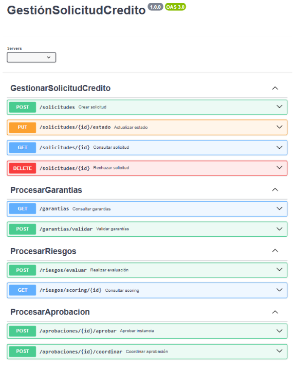

**Repositorio GitHub de Servicios REST:**  
🔗 [https://github.com/Natzgun/BankBpmSubsystems.git](https://github.com/Natzgun/BankBpmSubsystems.git)